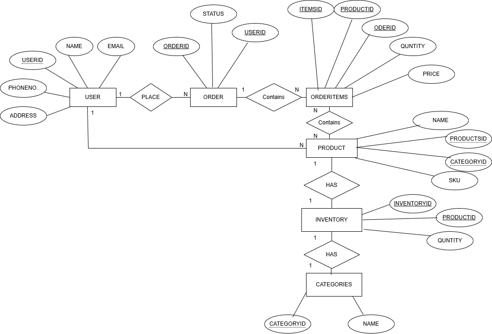

# Inventory Management — Database Design (PostgreSQL)

---

## 1. Overview

### System Overview

An Inventory Management System is designed to manage:

* **Products:** Individual items available for sale.
* **Orders:** Transactional records of sales.
* **Categories:** Logical grouping of products.
* **Users:** System actors (Admin, Manager, Staff) and Customers.
* **Inventory:** To track products 
---

## 2. Database Information

* **Database Engine:** PostgreSQL
* **Version:** V1
* **Database Name:** Inventory Management

---

## 3. Entity Relationship Overview

### Core Entities

| Entity       | Purpose                              |
| ------------ | ------------------------------------ |
| `users`      | System users (admin, manager, staff) |
| `categories` | Product grouping                     |
| `products`   | Inventory items                      |
| `orders`     | Customer order records               |
| `orderitems` | Products inside an order             |
| `inventory`  | Stock tracking per product           |

---

## 4. Entity Relationship Diagram (ERD)

### Relationships

* **User → Order:** One-to-Many (1 user can have many orders)
* **Order → OrderItem:** One-to-Many (1 order can have many order items)
* **Product → OrderItem:** One-to-Many (1 product can be in many order items)
* **Category → Product:** One-to-Many (1 category has many products)
* **Product → Inventory:** One-to-One (1 product has 1 inventory record)

### Diagram

---

### 4.1 Relationships Summary

| From       | To          | Relationship |
| ---------- | ----------- | ------------ |
| users      | orders      | 1 → N        |
| orders     | orderitems | 1 → N         |
| categories | products    | 1 → N        |
| products   | orderitems | 1 → N         |
| products   | inventory   | 1 → 1        |

---

## 5. Table Definitions

### 5.1 `users` — Stores system users

| Column      | Type         | Constraints |
| ----------- | ------------ | ----------- |
| userid      | VARCHAR(100) | Primary Key |
| name        | VARCHAR(100) | NOT NULL    |
| email       | VARCHAR(150) | NOT NULL    |
| phonenumber | VARCHAR(20)  | NOT NULL    |
| address     | VARCHAR(255) | NOT NULL    |

**Primary Key:** `userid`
* A Primary Key is a column (or set of columns) that uniquely identifies each row in a table.
* No two rows can have the same primary key value, and it cannot be NULL.
---

### 5.2 `products` — Stores product information

| Column      | Type          | Constraints                     |
| ----------- | ------------- | ------------------------------- |
| productsid  | VARCHAR(150)  | Primary Key                     |
| name        | VARCHAR(150)  | NOT NULL                        |
| sku         | VARCHAR(50)   | NOT NULL                        |
| description | TEXT          | —                               |
| price       | NUMERIC(10,2) | NOT NULL                        |
| categoryid  | VARCHAR(150)  | FK → `categories(categoriesid)` |

**Primary Key:** `productsid`
**Foreign Key:** `categoryid → categories(categoriesid)`
* A Foreign Key (FK) is a column in one table that references the Primary Key of another table.
* It creates a relationship between two tables and ensures data integrity.

**Search products by name:**

`CREATE INDEX idx_products_name ON products(name);`

**Filter products by category:**

`CREATE INDEX idx_products_category ON products(category_id);`

---

### 5.3 `categories` — Stores product categories

| Column       | Type         | Constraints      |
| ------------ | ------------ | ---------------- |
| categoriesid | VARCHAR(150) | Primary Key      |
| name         | VARCHAR(100) | UNIQUE, NOT NULL |

**Primary Key:** `categoriesid`

---

### 5.4 `orders` — Stores customer orders

| Column       | Type          | Constraints          |
| ------------ | ------------- | -------------------- |
| ordersid     | VARCHAR(100)  | Primary Key          |
| userid       | VARCHAR(100)  | FK → `users(userid)` |
| status       | VARCHAR(20)   | NOT NULL             |
| total_amount | NUMERIC(12,2) | NOT NULL             |

**Primary Key:** `ordersid`
**Foreign Key:** `userid → users(userid)`

**Find orders by user:**

`CREATE INDEX idx_orders_user ON orders(userid);`

**Find orders by status:**

`CREATE INDEX idx_orders_status ON orders(status);`

---

### 5.5 `inventory` — Tracks stock levels per product

| Column      | Type         | Constraints                 |
| ----------- | ------------ | --------------------------- |
| inventoryid | VARCHAR(100) | Primary Key                 |
| productid   | VARCHAR(100) | FK → `products(productsid)` |
| quantity    | INTEGER      | NOT NULL                    |

**Primary Key:** `inventoryid`
**Foreign Key:** `productid → products(productsid)`
**Unique Constraint:** One inventory record per product

**Lookup inventory by product:**

`CREATE INDEX idx_inventory_product ON inventory(productid);`

---

### 5.6 `orderitems` — Stores individual products within an order

| Column    | Type          | Constraints                 |
| --------- | ------------- | --------------------------- |
| itemsid   | VARCHAR(100)  | Primary Key                 |
| orderid   | VARCHAR(100)  | FK → `orders(ordersid)`     |
| productid | VARCHAR(100)  | FK → `products(productsid)` |
| quantity  | INTEGER       | NOT NULL                    |
| price     | NUMERIC(10,2) | NOT NULL                    |

**Primary Key:** `itemsid`
**Foreign Keys:-** 

* `orderid → orders(ordersid)`
* `productid → products(productsid)`

**Order items FKs**

`CREATE INDEX idx_order_items_order_id ON orderitems(orderid);`
`CREATE INDEX idx_order_items_product_id ON orderitems(productid);`

## 6. Database Indexing Strategy

* Indexes are used to improve the performance of database queries by allowing the database engine to locate data quickly without scanning the entire table.
* The Inventory Management System uses PostgreSQL indexing strategies to optimize frequently executed queries such as product searches, user authentication, and inventory lookups.

### Primary Key Indexes in PostgreSQL

* In PostgreSQL, when you define a PRIMARY KEY, the database automatically creates a unique **B-tree index** for that column.

* This index is used to:

A Primary Key guarantees that every row in the table is unique.

Because PostgreSQL automatically creates an index on the primary key, searches become very fast.

* `Without an index:`

`Example query:`
`SELECT * FROM users WHERE id = 2;`

- Database scans every row (slow).

* `With primary key index:`

`Example query:`
`CREATE INDEX idx_products_name ON products(name);`

| Part                | Meaning                                                                                     |
| ------------------- | ------------------------------------------------------------------------------------------- |
| `CREATE INDEX`      | SQL command to create an index on a table column.                                           |
| `idx_products_name` | Name of the index. You choose it so you can reference it later (e.g., drop it or check it). |
| `ON products(name)` | Specifies **table** (`products`) and **column** (`name`) that the index is for.             |

- Database directly finds the row (very fast).
---
### Foreign Keys and Indexing

* Most relational databases, including PostgreSQL, automatically create an index on a PK but do NOT automatically index FKs.

**Implication:**

- If you frequently query or join using an FK column, you should manually create an index.

- Without an index on the FK, queries like this are slow for large tables.

-- Products table FKs
`CREATE INDEX idx_products_categoryid ON products(categoryid);`

* A query searches for all products in category “Electronics”.

* PostgreSQL uses idx_products_category_id to directly locate all rows with categoryid of Electronics.

* Result: no full table scan, query is much faster.

---

###  Unique Indexes

A Unique Index ensures that the values in a column (or group of columns) are unique.
It also improves search performance because PostgreSQL can quickly locate rows using the index.

* Example Use Case

In a products table, every product usually has a Productid.
Two products should never have the same Productid.

`CREATE UNIQUE INDEX idx_products_productid`
`ON products(productid);`

* This does two things:

1.  duplicate values

2.  an index for fast searching

| productid | name   | sku   | price |
| -- | ------ | ----- | ----- |
| 1  | Laptop | LP100 | 50000 |
| 2  | Mouse  | MS200 | 500   |

* If someone tries to insert a duplicate SKU:
 * PostgreSQL will return an error like:
   ERROR: duplicate key value violates unique constraint

* Benefits of Unique Index
- Prevents Duplicate Data
- The unique index allows PostgreSQL to find the row instantly.
- It protects the database from invalid duplicate records.

---

