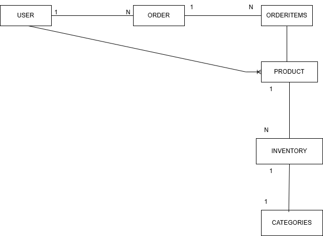

# Inventory Management — Database Design (PostgreSQL)

---

## 1. Overview

### System Overview

An Inventory Management System is designed to manage:

* **Products:** Individual items available for sale.
* **Orders:** Transactional records of sales.
* **Categories:** Logical grouping of products.
* **Users:** System actors (Admin, Manager, Staff) and Customers.

---

## 2. Database Information

* **Database Engine:** PostgreSQL
* **Version:** 15
* **Database Name:** Inventory Management
* **Primary Key Strategy:** UUID
* **Design Standard:** 3rd Normal Form (3NF)

---

## 3. Entity Relationship Overview

### Core Entities

| Entity       | Purpose                              |
| ------------ | ------------------------------------ |
| `users`      | System users (admin, manager, staff) |
| `categories` | Product grouping                     |
| `products`   | Inventory items                      |
| `orders`     | Customer order records               |
| `orderitems` | Products inside an order             |
| `inventory`  | Stock tracking per product           |

---

## 4. Entity Relationship Diagram (ERD)

### Relationships

* **User → Order:** One-to-Many (1 user can have many orders)
* **Order → OrderItem:** One-to-Many (1 order can have many order items)
* **Product → OrderItem:** One-to-Many (1 product can be in many order items)
* **Category → Product:** One-to-Many (1 category has many products)
* **Product → Inventory:** One-to-One (1 product has 1 inventory record)

### Diagram

---

### 4.1 Relationships Summary

| From       | To          | Relationship |
| ---------- | ----------- | ------------ |
| users      | orders      | 1 → N        |
| orders     | order_items | 1 → N        |
| categories | products    | 1 → N        |
| products   | order_items | 1 → N        |
| products   | inventory   | 1 → 1        |

---

## 5. Table Definitions

### 5.1 `users` — Stores system users

| Column      | Type         | Constraints |
| ----------- | ------------ | ----------- |
| userid      | VARCHAR(100) | Primary Key |
| name        | VARCHAR(100) | NOT NULL    |
| email       | VARCHAR(150) | NOT NULL    |
| phonenumber | VARCHAR(20)  | NOT NULL    |
| address     | VARCHAR(255) | NOT NULL    |

**Primary Key:** `userid`

---

### 5.2 `products` — Stores product information

| Column      | Type          | Constraints                     |
| ----------- | ------------- | ------------------------------- |
| productsid  | VARCHAR(150)  | Primary Key                     |
| name        | VARCHAR(150)  | NOT NULL                        |
| sku         | VARCHAR(50)   | NOT NULL                        |
| description | TEXT          | —                               |
| price       | NUMERIC(10,2) | NOT NULL                        |
| categoryid  | VARCHAR(150)  | FK → `categories(categoriesid)` |

**Primary Key:** `productsid`
**Foreign Key:** `categoryid → categories(categoriesid)`

---

### 5.3 `categories` — Stores product categories

| Column       | Type         | Constraints      |
| ------------ | ------------ | ---------------- |
| categoriesid | VARCHAR(150) | Primary Key      |
| name         | VARCHAR(100) | UNIQUE, NOT NULL |

**Primary Key:** `categoriesid`

---

### 5.4 `orders` — Stores customer orders

| Column       | Type          | Constraints          |
| ------------ | ------------- | -------------------- |
| ordersid     | VARCHAR(100)  | Primary Key          |
| userid       | VARCHAR(100)  | FK → `users(userid)` |
| status       | VARCHAR(20)   | NOT NULL             |
| total_amount | NUMERIC(12,2) | NOT NULL             |

**Primary Key:** `ordersid`
**Foreign Key:** `userid → users(userid)`

---

### 5.5 `inventory` — Tracks stock levels per product

| Column      | Type         | Constraints                 |
| ----------- | ------------ | --------------------------- |
| inventoryid | VARCHAR(100) | Primary Key                 |
| productid   | VARCHAR(100) | FK → `products(productsid)` |
| quantity    | INTEGER      | NOT NULL                    |

**Primary Key:** `inventoryid`
**Foreign Key:** `productid → products(productsid)`
**Unique Constraint:** One inventory record per product

---

### 5.6 `orderitems` — Stores individual products within an order

| Column    | Type          | Constraints                 |
| --------- | ------------- | --------------------------- |
| itemsid   | VARCHAR(100)  | Primary Key                 |
| orderid   | VARCHAR(100)  | FK → `orders(ordersid)`     |
| productid | VARCHAR(100)  | FK → `products(productsid)` |
| quantity  | INTEGER       | NOT NULL                    |
| price     | NUMERIC(10,2) | NOT NULL                    |

**Primary Key:** `itemsid`
**Foreign Keys:**

* `orderid → orders(ordersid)`
* `productid → products(productsid)`

---

